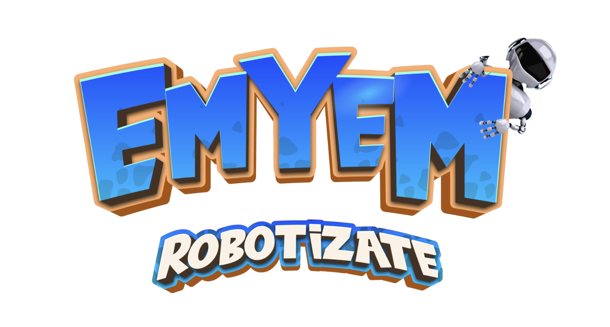
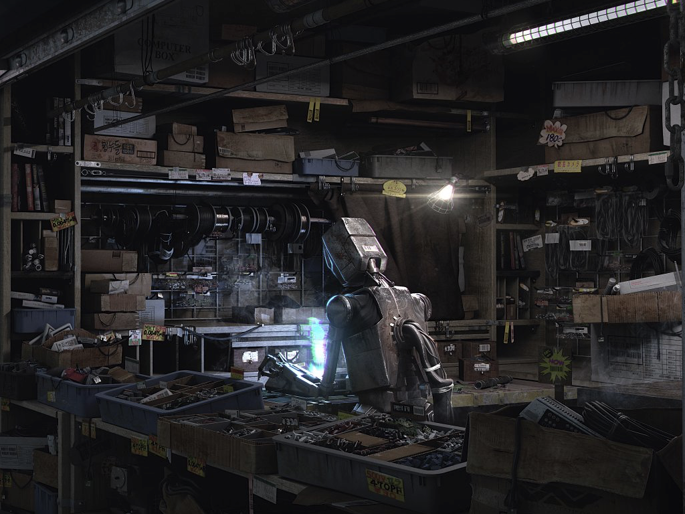

# 🤖 ▬ 𝐄𝐦𝐲𝐞𝐦

##

_Emyem es un juego de rol (RPG) desarrollado en tecnología blockchain, basada en NFT(Token no fungible),  el cual obtienes recompensas (MYM token) solamente por jugar. _

_Esta desarrollado  e implementado en la plataforma Binance Smart Chain. (BSC)_

El juego se desarrolla en un mundo paralelo, en el cual existe un planeta llamado Kepler, lugar donde habita una metrópoli de droides . Desafortunadamente, no todo era paz. Un ataque droide desde otra galaxia, dejo el planeta sin apenas grafeno, material fundamental para la vida diaria de los robot.  Así, buscaban destruir a todos los habitantes del planeta Kepler, incluyendo en sus planes la destrucción del gran mercado negro de Kepler, el cual tenía un volumen de grafeno inusual para aquel planeta. Sin embargo, no todas las esperanzas se perdieron, puesto que con el poder de los habitantes droides, la lucha se ha vuelto encarnizada y duradera, sometiendo el planeta Kepler a décadas de guerra. Las nuevas generaciones de robot se han convertido en luchadores y soldados incansables, todo para proteger el hogar de los invasores.

━━━━━━━━━━━━━━━━━━✧🤖✧━━━━━━━━━━━━━━━━━━━━

En el Juego, conseguirás dominar el mundo robótico, que también son tus activos digitales en la lucha contra los tus rivales. Cada robot es único e igualmente accesible para todos Mediante la exploración "** Farming" **y la minería . No existe una barrera de inversión inicial para Emyem, cada jugador puede jugar usando solo 1 robot común  que se puede usar en todos los modos de juego. Con el grafeno del juego adquirido jugando, los jugadores pueden obtener las materiales, que pueden convertirse en cualquier robot, desde las más comunes hasta legendarios. Por supuesto, los robot pueden comprarse y venderse en el " **Mercado** " que creamos con tecnologías constantemente mejoradas para satisfacer las necesidades de nuestros jugadores.

[\
](https://plantvsundead.gitbook.io/pvu-whitepaper/unique-and-premier-selling-points)━━━━━━━━━━━━━━━━━━✧🤖✧━━━━━━━━━━━━━━━━━━━━

Nuestro objetivo final en el desarrollo del juego es contribuir a un nuevo capítulo de la historia de juegos NFT,  combinando la tecnología blockchain mas nuevas, teniendo en cuenta que la experiencia de juego de los jugadores que cada vez es mayor. Jugar y jugar para ganar, son nuestras principales prioridades. Llegar a todo tipo de dispositivos es nuestra meta. Puedes jugar Emyem en cualquier lugar y en cualquier momento.

Los activos son NFT propiedad de los jugadores que pueden negociarse en el mercado propietario.

━━━━━━━━━━━━━━━━━━✧🤖✧━━━━━━━━━━━━━━━━━━━━

_"En una planeta no muy lejano, llamado Kepler, habitaba una metrópolis de droides existente, manteniendo en ella, el gran mercado negro de grafeno. Era una periodo de guerra interminable, puesto que la invasión de droides desde galaxia, obligaban a cada robot, proteger su pequeño desguace, recolectando materiales y construyendo de a poco su propio imperio robótico. ¿Nos quedaremos con los brazos cruzados? Gritaban algunos! Es hora de programar un nuevo ejército automatizado!"_
